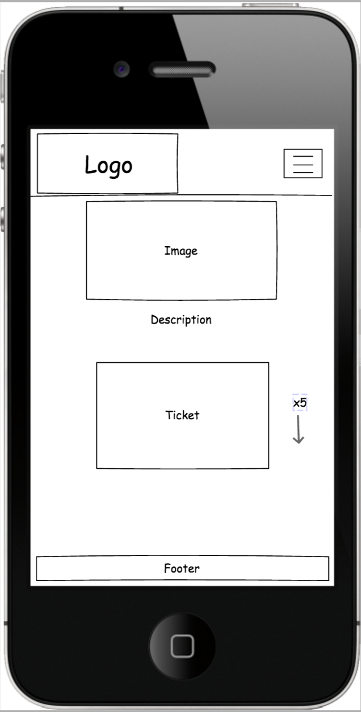

 # UCD - Milestone Project 1 - The Monkees - Charlie Tipton
 
 ## Link to the website
 
 https://charliejt.github.io/The-Monkees/
 
 
 ## Link to Cloud9 Development
 
 https://ide.c9.io/charliejt/first-milestone-project
 
 
 ## About
 
 This is a front-end website on the American rock and pop band "The Monkees" 
 which provides a listing of their top albums, audio tracks and a playable video
 on the home screen of a popular song of theirs, "Daydream Believer".

The website also has a listing of the band's UK tour availability and an option 
to select tickets to see them performing live. Also, an option has been provided 
for booking the band for events such as Christmas parties, Weddings etc. and also ticket listings.

 ## UX Experience

The primary focus of the website is to showcase the band's top-rated music to all users,
 provide potential fans with brief and relevant information about the band, for the band
 to publicize their availability, ensure the users a fast and easy approach for booking
 the band for events and for ticket listings for users who would like to see the band performing live.
 
 The site has been produced to ensure the user gets an easy, informative and enjoyable experience
 about the band and everything that the band has to offer.
 
 
 #### Wireframes - Mobile
 
 Home
 
  ->  -> 
 
 About
 
 
 
 Music
 
 
 
 Book
 
 
 
 Tickets
 
 
 
 #### Wireframes - Desktop
 
 Home
 
  ->  -> 
 
 About
 
 
 
 Music
 
 
 
 Book
 
 
 
 Tickets
 
 
 
 ## Features
 
 ### Features Used
 
 #### Feature 1: Navbar
 
 The affixed navbar is created to use basic navigation from one page to another. Each page link
 in the navbar slightly expands in size to indicate which page is selected. A hover pseudo-class
 is used; slowly darkening each page link in colour when hovered over.

 #### Feature 2: Navbar Burger Icon
 
 When dropped down to an ‘xs’ display (767px and below), the navbar page links collapse down into
 a 'burger icon’. Navigation is still kept with the same effects with additional social icons added
 to the bottom of the page links.

 #### Feature 3: Footer Social Links
 
 On all displays, a group of 5 social links have been added to the footer of the page linking the
 band’s social media, Facebook, Instagram, Twitter, Youtube and Spotify. When clicked, each link
 will open up in a new tab to avoid the user exiting the current website. the background of
 each icon slightly largens and darkens when hovered over. This is shown on each page of the site.

 #### Feature 4: Video of the Monkees - Home Page
 
 After the main image of the site, a video has been added of the band performing "Daydream Believer".
 Below the video, it also has a link to their ‘music’ page on the site.

 #### Feature 5: Tickets - Home Page
 
 Upcoming tickets have been added to the home screen with a ‘see more’ button to click as a link
 to the ‘tickets’ page on the site.

 #### Feature 6: Booking - Home Page
 
 A Booking section is displayed on the home screen with an image of the band performing, a quick
 description and a link to the ‘Book’ page.

 #### Feature 7: ‘Music’ Page
 
 The ‘Music’ page has a main image of the band with a listing of 8 albums, images of the albums
 & names of albums. Below that are 4 playable audio tracks with images & names of each track.

 #### Feature 8: ‘About’ Page
 
 The ‘About’ page has a main image of the band and a paragraph of information about the band.
 Below, there are pictures of each band member with a paragraph of information about each member.

 #### Feature 9: ‘Book’ Page
 
 The ‘Book’ page has a main image of the band on stage with a brief description of booking. A 
 form has been added with inputs Name, Email, Date, Event Type, Any Additional Message and a “Submit” button. 
 The form uses basic validation.

 ##### Feature 10: ‘Tickets’ Page
 
 The ‘Book’ page has the main image of a crowd at a concert, a brief description of ticket
 information and a display of 5 responsive ticket selections with a date, city, venue and a
 clickable button depending on ticket availability. A modal has been added to each selection
 with available tickets providing you with inputs email, amount of tickets and a ‘submit’ button.

 ### Features Left to Implement
 
 #### Feature 1 - Additional Tour Dates
 
 A listing of additional tour dates in later months.

 #### Feature 2 - Additional Music
 
 A listing of additional albums, tracks and video as they become available.

 #### Feature 3 - Registration Button
 
 Implementation of a registration button so users can get notifications on updates on the website
 such as ticket dates, booking information and additional music.

 #### Feature 4 - Booking form link
 
 Booking form to be linked to an external server.

 #### Feature 5 - News Section
 
 News section to inform the user of any updates on the band.

 ## Technologies Used
 
 ### HTML5 & CSS3
 
 HTML5 & CSS3 were used to create basic structure, positioning and styles to features on the website.
 
 
 ### Bootstrap - https://www.bootstrapcdn.com/
 
 Bootstrap 3.3.7 is used to create frameworks of a mobile-first design, it was used for navigation
 and page grid layout in the website.
 
 
 ### JQuery - https://jquery.com/
 
JQuery is added to the site to assist the implementation of JavaScript and Bootstrap.

 ### Font Awesome - https://www.bootstrapcdn.com/fontawesome/
 
 Font Awesome is used to add social links to the website. These icons are Facebook, Instagram, Twitter,
 YouTube and Spotify.
 
 
 ### Google Fonts - https://fonts.google.com/
 
 Google fonts are used to create various different fonts throughout the website. 
 * 'Luckiest Guy': Used for headings.
 * 'Oswald': Used for the form and page paragraphs
 * 'Helvetica': Used for buttons.
 

 ### Font Awesome - https://www.bootstrapcdn.com/fontawesome/
 
 Font Awesome is used to add social links to the website. These icons are Facebook, Instagram, Twitter,
 YouTube and Spotify.
 
 
 ### Git & GitHub - https://github.com/
 
 Git is used as a command line tool to push my work from my local repository into a remote repository 'Github',
 Github is used to allow other users to see the deployed version of my website.
 
 
 ## Testing
 
 ### Responsive Mobile-First Design
 
 The website has been tested on Mobile, Tablet & Desktop with each feature and section being tested numerous times
 to ensure that the responsiveness has no errors. I tested on all devices in Chrome DevTools and I tested each feature
 through each breaking point. I added on 'Responsive Web Design Tester' to my Chrome and tested my website with many
 different displays varying from portrait to landscape.
 
 Some of my friends volunteered to have a look through the website on their devices. The devices that the website has
 been tested on are as follows:
 * Desktop PC
 * MacBook Pro
 * iPad
 * iPhone 5, 5 SE, 6, 7, 8
 * Samsung
 

 ### Issues Encountered With Responsiveness
 
 * #### Navbar Links dropping to next line
   From '768px - 773px', there was a break where the Navbar links were moving to the second line. I fixed this
   by shortening down the word spacing on the navbar logo.
 
 * #### Album images jumping
   Throughout medium and small display, images were jumping onto the next line at certain breaking points. With changing
   the margins and font sizes, I was able to overcome the issue. 

 * #### Tickets not sitting correctly
   It was difficult to ensure that all tickets in the tickets section were responsive, I had an issue with the text and button
   sitting inside of the border. I added media queries to manipulate paddings and margins and everything eventually worked ok.
 

 ### Issues still to be fixed
 
 * #### Dates field in the form
   After running my code through the 'Markup Validation Service', it recommended using 'Polyfill' to ensure the dates field
   is compatible with older browsers. I will learn more about 'Polyfill' at a later date.